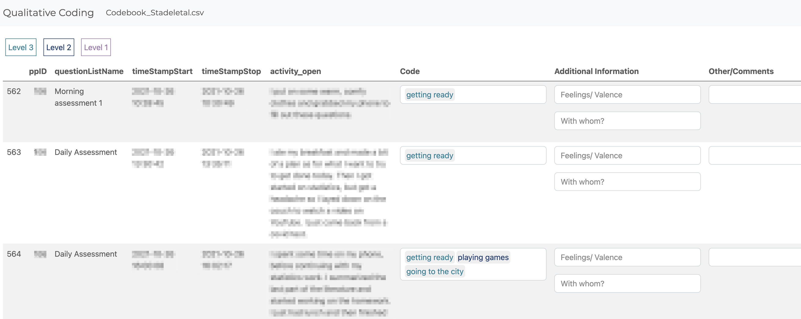
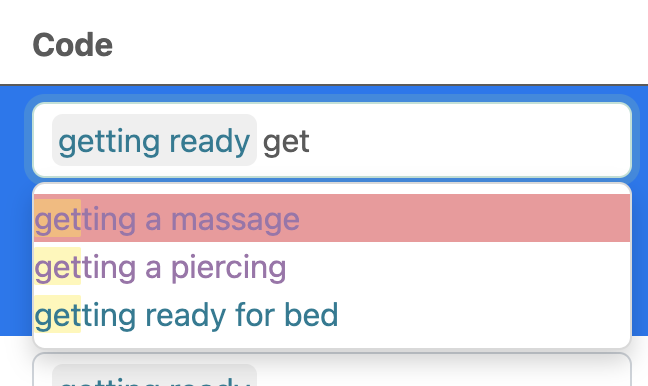

## Shiny App to Code Qualitative ESM data


[](https://doi.org/10.5281/zenodo.21043127)


Here we provide a shiny app that can be used by other researchers to
code qualitative ESM data based on a given coding scheme. It contains
several columns showing the raw observation (see screenshots below
“activity_open”) and the given code (“Code”). To accommodate information from different coding dimensions (e.g., company mentioned alongside activities), our app includes two additional columns for capturing such information. The first column, “Additional Information,” is intended for details about participants' feelings and the social context during activities. The second column, “Other/Comments,” can be used for any other relevant information or observations. Our codes have a
hierarchical structure and are therefore displayed in different colors.

This app was build as part of the project “Assessing Daily Life
Activities: Comparing Predefined Categories with the Qualitative
Analysis of Open-Ended Responses in Experience Sampling Methodology
(ESM)” Marie Stadel, Anna M. Langener, Katie Hoemann, Laura Bringmann.



To facilitate the coding process, a list of codes appears when clicking on the “Code” field, and matching codes are suggested interactively while typing.



To use this app, download the repository and open `app.R` in RStudio
(<https://posit.co/download/rstudio-desktop/>). On its start screen, the
consolidated app lets you select the data and mode-specific codebook
files for each coding session.

The app runs locally, so there are no privacy concerns when using it.

## Start a coding session

All three coding activities are available from one start screen. Open
`app.R` in RStudio, click **Run App**, and make the following
selections:

1. **Coding activity.** Choose **Deductive coding**, **Inductive
   coding: Phase 1**, or **Inductive coding: Phase 2**. This determines
   which codebook and coding fields are shown.
2. **Coder (user).** Enter a name or coder ID. This becomes part of the
   coded-data filename so different coders get separate files.
3. **Data file.** Select the CSV or Excel file containing the ESM data.
4. **Participant.** Choose the column containing participant IDs, then
   choose the participant to code from the IDs found in that column.
   Only that participant's observations are loaded into the coding
   table.
5. **Display columns.** After selecting the data file, choose which of
   its columns should appear in the coding table. The columns normally
   used by the selected coding activity are selected by default.
6. **Codebook file(s).** For deductive coding, select the separate
   thought, activity, location, and company codebooks. For inductive
   Phase 2, select the event codebook. This field is not shown for
   inductive Phase 1 because that activity does not use a codebook.
7. Click **Start Coding**. The coded CSV is saved automatically in the
   same folder as the selected data file.

At least one display column must be selected. Coding-entry columns are
always included in the table and are not affected by this selection.

Both the coder and participant ID are required. Leading and trailing
spaces are ignored. Because these values are used in file names, they
cannot contain `< > : " / \ | ? *`.

Use **Change coding activity** above the coding table to return to the
start screen. This reloads the app, so the activity, coder, participant,
and input files can be selected again.

## Prepare the input files

Input files may be stored in any folders and may have any names. CSV
(`.csv`) and Excel (`.xls` or `.xlsx`) files are supported. The app
reports missing required columns before starting the coding table.

The selected data file must contain a participant ID column. If it is
named `Participant_ID`, the app selects it by default; otherwise, the
first data column is selected initially and can be changed. The app
orders the selected data by the chosen participant ID column and `Obs`.

All activities require a selected participant ID column plus `Day`,
`Obs`, `Time1`, `Thought`, `Activity`, `Location`, and `Company`.
Deductive coding additionally requires `Thought_ENG`, `Activity_ENG`,
`Location_ENG`, and `Company_ENG`; both inductive phases require
`Event`.

The selected activity determines which codebooks are required:

- **Deductive coding** requires separate thought, activity, location,
  and company codebook files.
- **Inductive coding: Phase 1** does not load a codebook.
- **Inductive coding: Phase 2** requires one event codebook file.

Codebooks must contain a column named `Code`. The deductive thought and
activity codebooks must also contain a `Level` column; those levels are
displayed in different colors.

## Coder and participant result files

The app creates one CSV result file per coder and participant in the
same folder as the selected data file. Its name combines the input
file's name (without its extension), the participant ID, and the coder:

``` text
<original_name>_<participant_id>_<coder>.csv
```

If that file already exists, it is loaded so coding can continue where
it stopped. Otherwise, the app creates it with empty (`NA`) coding
values.

## Analyze the data

This repository also contains some simple R code to start analyzing the
data:
[Results_Analysis.Rmd](https://github.com/AnnaLangener/QualitativeCodingApp/blob/Anna_Tests/Results_Analysis.Rmd "Results_Analysis.Rmd").
For example, we provide some code to read the results from each
participant and calculate the frequency of how often a particular code
was used.

## Questions/Problems?

Write an email to anna.m.langener\[at\]dartmouth.edu, langener95\[at\]gmail.com,
or m.stadel\[at\].tilburguniversity.edu
